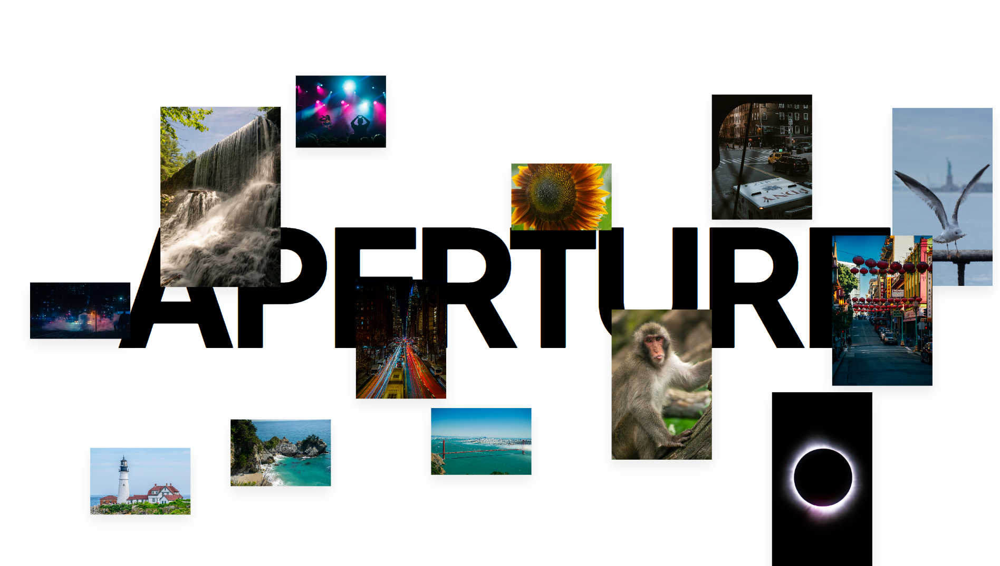

<p align="center">
  
</p>

<h1 align="center">
  Photo Portfolio
  <br>
</h1>

<h4 align="center">Just a little site to show off photos from my photography hobby.</h4>

<p align="center">
  <a href="https://reactjs.org/" target="_blank" rel="noopener noreferrer">
    
  </a>
  <a href="https://vitejs.dev/" target="_blank" rel="noopener noreferrer">
    
  </a>
  <a href="https://www.framer.com/motion/" target="_blank" rel="noopener noreferrer">
    
  </a>
  <a href="https://immich.app/" target="_blank" rel="noopener noreferrer">
    
  </a>
  <a href="https://docker.com/" target="_blank" rel="noopener noreferrer">
    
  </a>
</p>

## What is this?

Photography is just a hobby of mine, and this is where I dump my favourite shots. Rather than manually uploading photos to the site every time, it just pulls whatever's in my [Immich](https://immich.app/) albums, so I can add a new photo on my phone and it shows up here automatically.

## Demo

Live at [photo.shreyanshsahu.co](https://photo.shreyanshsahu.co)

## Features

### Landing

- **Interactive canvas hero** — a mouse-reactive collage of favourite shots rendered on `<canvas>`, with parallax drift and hover zoom
- **Cycling headline** — "ISO / Aperture / Shutter" animated with Framer Motion
- **About Me** — bio, a profile photo, and a favourite-photo callout with a hand-drawn annotation

### Galleries

- **Album selector** — a comic-book-style panel picker (Cityscape, Events, Nature, Street, Wildlife) that expands and reveals its theme color on hover/tap
- **Live photo fetching** — each album queries the Immich REST API directly for its assets, no local copies
- **Orientation-aware grid** — portrait and landscape shots get different grid treatment automatically
- **Image modal** — full-screen lightbox with next/prev navigation


## Architecture

- **Frontend**: React + Vite, statically built and served by Nginx
- **Photo backend**: a self-hosted Immich instance, queried client-side via its REST API
- **Deployment**: Docker container behind Traefik, built and restarted by a self-hosted GitHub Actions runner on every push to `main`

## Project structure

```
src/
  pages/
    Home/           Landing canvas, about me, album selector
    Album/          Album grid + image modal
  services/
    immich.js       Immich API client (fetches album photos)
  data/
    assets.js       Landing canvas images + album metadata
docker/             Dockerfile, nginx config, compose file for deployment
```

## Technologies used

### Frontend

- **React** — UI framework
- **Vite** — build tool and dev server
- **Framer Motion** — animation

### Backend / infra

- **Immich** — self-hosted photo management, used as the content API
- **Docker** — containerized production build
- **Nginx** — static file serving
- **Traefik** — reverse proxy on the host
- **GitHub Actions** — CI/CD, deploying to a self-hosted runner on push to `main`
